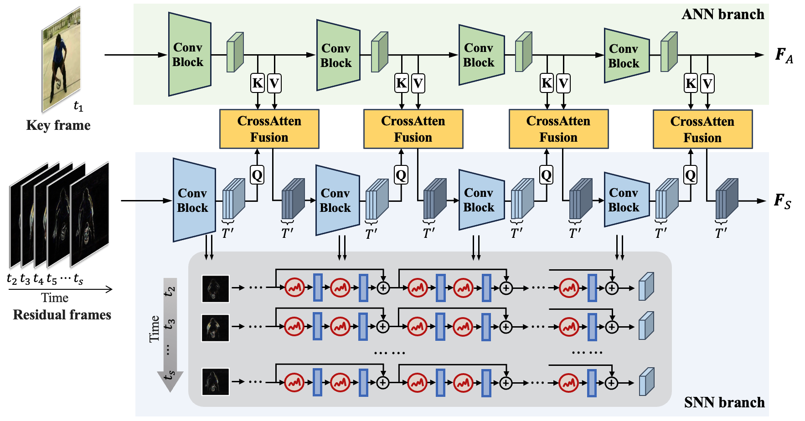

# ReSpike
Pytorch implementation code for [ReSpike: Residual Frames-based Hybrid Spiking
Neural Networks for Efficient Action Recognition](https://arxiv.org/abs/2409.01564). 



## Install

Create a `conda` environment using `torch==2.1.0` and `torchvision==0.16.0` with CUDA 12 support. We tested our code in this enviroment.

```
conda create -n respike python=3.10
conda activate respike
conda install pytorch==2.1.0 torchvision==0.16.0 pytorch-cuda=12.1 -c pytorch -c nvidia
```

Install the required packages using `pip install -r requirements.txt`.

## Dataset Preperation

Download the HMDB-51 dataset from their [official website](https://serre-lab.clps.brown.edu/resource/hmdb-a-large-human-motion-database/). Alternatively, download the HMDB-51 dataset using the `torchvision.datasets.HMDB51` [API](https://pytorch.org/vision/main/generated/torchvision.datasets.HMDB51.html).

Make sure to put the files as the following structure:

  ```
HBDM-51
├── brush_hair
│   ├── April_09_brush_hair_u_nm_np1_ba_goo_0.avi
│   └── ...
├── cartwheel
│   ├── Acrobacias_de_un_fenomeno_cartwheel_f_cm_np1_ba_bad_8.avi
│   └── ...
└── catch
│   ├── 96-_Torwarttraining_1_catch_f_cm_np1_le_bad_0.avi
│   └── ...
  ```

Set the dataset path in the `train_fusion.py`  file to your directory:

```
data_root = 'your directory'
annotation_path = 'your annotation directory'
```

Similarly, follow the same steps for the UCF-101 dataset. You can download the dataset through `torchvision.datasets.UCF101` API.

For the Kinetics dataset, please follow the instructions in the [Preparing Kinetics](https://github.com/open-mmlab/mmaction2/blob/main/tools/data/kinetics/README.md) document provided by [mmaction](https://github.com/open-mmlab/mmaction2/tree/main). Set the dataset path in the `train_kinetics.py`  file to your data directory.

## Running the code!

To train our ReSpike fusion network, on HMDB-51 or UCF-101, run

```
python train_fusion.py --dset hmdb51 --model resnet50 -T 16 -b 32 -lr 0.0001 --stride 4 --downsample
```
on Kinetics-400, run

```
python train_kinetics.py --dset kinetics400 -b 16 -T 16 --stride 2 -lr 0.0001 --model resnet50 -j 8 --downsample
```

## Acknowledgements

Thanks to the codebases [Stable Diffusion](https://github.com/CompVis/stable-diffusion) and [TDN](https://github.com/MCG-NJU/TDN?tab=readme-ov-file) which help us quickly implement our ideas. We use the cross-attention implementation from the  [Stable Diffusion](https://github.com/CompVis/stable-diffusion) repo and the Kinetics dataset implementation from the [TDN](https://github.com/MCG-NJU/TDN?tab=readme-ov-file) repo.

Special thanks to my co-author [Yuhang Li](https://github.com/yhhhli) for helping with the SNN backbone implementation.

## Citation

If you think our work is useful, please consider citing our paper:

```
@article{xiao2024respike,
  title={ReSpike: Residual Frames-based Hybrid Spiking Neural Networks for Efficient Action Recognition},
  author={Xiao, Shiting and Li, Yuhang and Kim, Youngeun and Lee, Donghyun and Panda, Priyadarshini},
  journal={arXiv preprint arXiv:2409.01564},
  year={2024}
}
```

